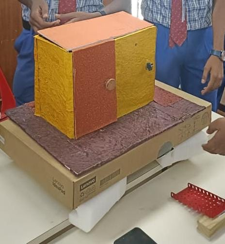
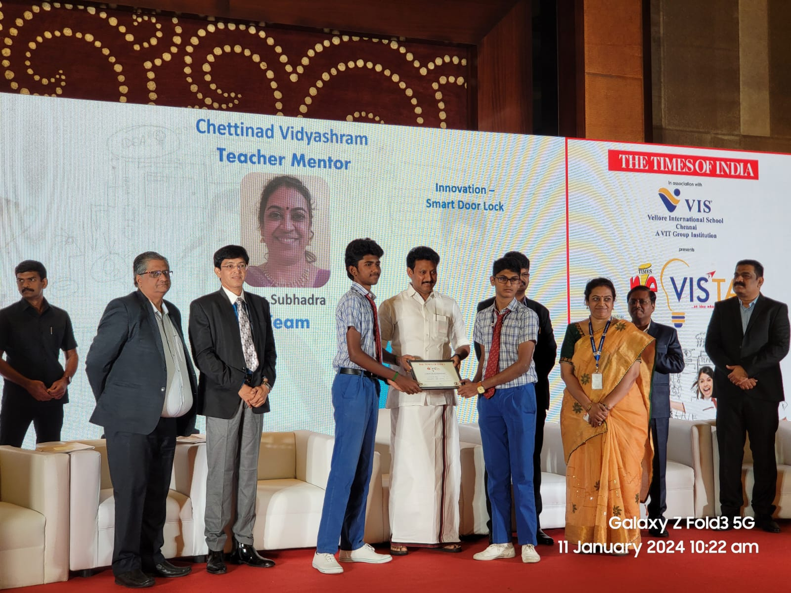

# IoT Smart Door Lock & Visitor Monitoring System

An IoT-enabled smart door security prototype combining **ESP32-CAM, visitor image capture, email notification, Alexa integration, and electric door-lock control**.

## 📌 Overview

Traditional door locks generally require the user to be physically present to operate the door. This project explores how **IoT and embedded systems** can be used to provide remote visitor monitoring and door-access functionality.

When a visitor activates the doorbell, the **ESP32-CAM captures an image** and sends the visitor's image to the owner through email.

The system also incorporates **Alexa-based remote door-control functionality** for operating the electric door lock.

---

## ⚙️ How It Works

```text
Visitor
   │
   ▼
Doorbell
   │
   ▼
ESP32-CAM
   │
   ├──► Capture Visitor Image
   │
   ▼
Wi-Fi
   │
   ▼
Gmail Notification
   │
   ▼
Owner
   │
   ▼
Remote Door Control
   │
   ▼
Electric Door Lock
```

### Main Workflow

1. A visitor activates the doorbell.
2. The ESP32-CAM detects the trigger.
3. The camera captures an image.
4. The image is sent through the internet using email.
5. The owner receives the visitor image.
6. The owner can use the remote door-control functionality.
7. The electric door-lock mechanism responds to the control command.

---

## 🧠 System Architecture


The system combines visitor monitoring with remote door-control functionality.

---

## 🔌 Circuit Diagram


> The circuit diagram documents the system-level hardware architecture. Exact GPIO assignments are configurable and should be matched to the physical prototype before deployment.

---

## ✨ Key Features

* 📷 ESP32-CAM based visitor monitoring
* 🔔 Doorbell-triggered image capture
* 📧 Visitor image email notification
* 🌐 Wi-Fi connectivity
* 🔐 Electric door-lock control
* 🗣️ Alexa integration
* 🏠 IoT-based smart-home concept
* 📡 Remote door-control functionality

---

## 🛠️ Hardware

* ESP32-CAM
* Camera module
* Doorbell switch
* Electric door lock
* Relay/control interface
* Power supply
* Alexa-enabled control interface

---

## 💻 Software & Technologies

* Arduino IDE
* Embedded C/C++
* ESP32
* Wi-Fi
* SMTP
* Gmail
* Alexa
* IoT
* LittleFS

---

## 📂 Repository Structure

```text
iot-smart-door-lock/
│
├── README.md
│
├── documentation/
│   └── system-architecture.png
│
├── circuit/
│   └── circuit-diagram.png
│
├── firmware/
│   ├── esp32_cam/
│   │   └── visitor_monitor.ino
│   │
│   └── door_control/
│       └── door_control.ino
│
└── images/
    ├── prototype.jpg
    ├── demonstration.jpg
    └── presentation.jpg
```

---

## 💾 Firmware

### ESP32-CAM Visitor Monitoring

Location:

```text
firmware/esp32_cam/visitor_monitor.ino
```

The ESP32-CAM firmware handles:

* Camera initialization
* Doorbell-trigger detection
* Visitor image capture
* Temporary image storage
* Email transmission

### Electric Door Lock Control

Location:

```text
firmware/door_control/door_control.ino
```

The door-control firmware provides the control layer for the electric door lock through a relay/control interface.

---

## 🔐 Security & Credentials

**Never upload real credentials to GitHub.**

The firmware uses placeholders for:

* Wi-Fi credentials
* Email address
* Email authentication credentials

Replace these locally when testing the hardware, but keep private credentials out of the public repository.

GitHub recommends using security features such as secret scanning and push protection for public repositories.

---

## 📸 Project Gallery

### Prototype



### Demonstration


### Presentation


---

## 🏆 Achievement

🥇 Prize awarded by the Educational Minister of Tamil Nadu for the project.
🏆 Selected among the Top Eleven teams for the Times NIE Vista Ideathon 2023–24 Grand Finale.
📍 Grand Finale held at Hilton Chennai.


---

## 👥 Team

**Ashwath Krishna S.**
**Jivitesh Kumar S.**

**Teacher-Mentor:** Mrs. Subhadra

---

## 🚀 Future Improvements

Potential extensions include:

* Multi-factor authentication
* RFID-based access
* Biometric authentication
* Cloud-based monitoring
* Wider-angle surveillance
* Additional visitor alerts
* Additional environmental sensors

---

## ⚠️ Project Note

This repository documents an **educational IoT prototype** demonstrating embedded systems, image capture, internet connectivity, email communication, automation, and electric door-lock control.

The repository documents the project architecture and implementation available from the prototype and project materials; hardware-specific values such as GPIO assignments should be matched to the actual physical hardware before use.

---

## 👤 Author

**Ashwath Krishna S.**

ECE Student | Embedded Systems | IoT | Hardware Projects
